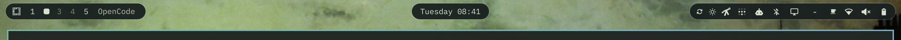

# Three Island Quickshell Bar

A theme-adaptive floating bar for the Omarchy Quickshell. Navigation stays on
the left, time remains geometrically centered, and system controls live on the
right with a collapsible secondary-status drawer.



## Features

- Three independent pill-shaped surfaces on horizontal bars
- Exact screen-centered clock, unaffected by side-island widths
- Hover-to-reveal secondary status widgets
- Click-to-pin status drawer
- Omarchy `Color` and `Style` tokens instead of hard-coded colors
- Existing widget panels, tooltips, drag handling, and multi-monitor behavior
- Continuous-bar fallback for left and right orientations
- Automatic fallback to the built-in bar if this plugin cannot load

## Requirements

- Omarchy 4.0 or later
- The Omarchy Quickshell plugin host

## Install

```bash
omarchy plugin add https://github.com/EdwardCaf/three-island-quickshell-bar.git --enable --yes
```

The plugin ID is `io.github.edwardcaf.floating-islands`. Activate it again at
any time with:

```bash
omarchy bar use io.github.edwardcaf.floating-islands
```

Installation does not replace your widget layout. For the intended hierarchy,
merge the `bar` object from [`examples/shell.json`](examples/shell.json) into
`~/.config/omarchy/shell.json`. The shell hot-reloads the file after saving.

## Status Drawer

The right island always displays entries not listed in `secondaryWidgets`.
Entries listed there stay mounted but are clipped until the island is hovered
or pinned open. This preserves panel routing and background refresh behavior.

Configure the drawer in the `bar` object:

```json
{
  "secondaryWidgets": [
    "omarchy.tray",
    "omarchy.weather",
    "omarchy.bluetooth",
    "omarchy.monitor"
  ]
}
```

When `secondaryWidgets` is omitted, the plugin uses sensible first-party
defaults. Third-party widget IDs can be added to the array normally.

## Themes

The bar reads `Color.bar.background`, `Color.bar.text`, `Color.bar.active`, and
shared `Style` metrics from the active Omarchy theme. Theme switches therefore
change color, opacity, typography, spacing, and scale without bar-specific
palette files.

Set `bar.transparent` to `true` if you want the island backgrounds hidden:

```bash
omarchy bar transparent toggle
```

## Remove Or Roll Back

Return to the built-in bar before removing the plugin:

```bash
omarchy bar reset
omarchy plugin remove io.github.edwardcaf.floating-islands --yes
```

Your widget layout remains in `~/.config/omarchy/shell.json`.

## Development

The bar is intentionally a small fork of Omarchy's built-in bar engine so it
retains the host's widget and panel contracts. Validate a checkout with:

```bash
omarchy plugin validate .
```

The plugin targets Omarchy 4.0. Changes to the upstream bar engine may need to
be merged into `Bar.qml` and `BarModel.js` after future Omarchy releases.

## Attribution

Based on the MIT-licensed Omarchy bar from
[`basecamp/omarchy`](https://github.com/basecamp/omarchy). The upstream
copyright notice is retained in [`LICENSE`](LICENSE).
